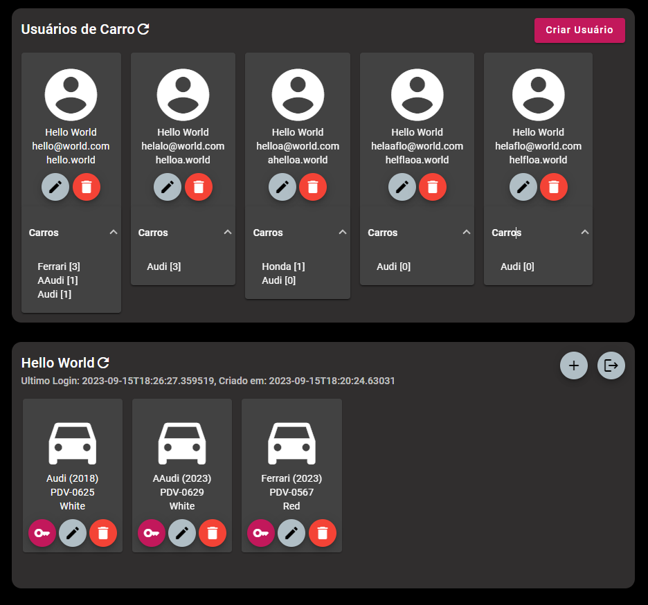

# CARS

API RESTful para Sistema de Usuários de Carros

## SOLUÇÃO

### Backend
Para o backend, foi utilizado spring boot 3 com hibernate e banco de dados em memória H2. A API foi separada em três controllers:
**PublicController.java** é onde estão os endpoints que podem ser acessados sem token de autenticação,
no **AuthController.java** estão ```/api/signin``` e ```/api/signout```, endpoints de autenticação e no **PrivateController.java** estão os endpoints autenticados. Para validação do token, foram criadas uma anotação (```CheckAuthorization.java```) e uma classe anotada com ```@Aspect``` (```AuthorizationAspect.java```) para interceptar a execução dos métodos anotados com ela, assim os endpoints só são executados após as validações necessárias. 
Todas as requisições com body possuem um objeto configurado com as anotações do ```jakarta.validation```, os controllers possuem a anotação ```@Validated``` e os parametros que precisam ser validados são anotados com ```@Valid```. O **ImageUploadController.java** está o endpoint para upload de imagem do veículo.

Ao criar um usuário, a senha é criptografada usando o ```CryptUtils.java``` usando o algoritmo de derivação de chave PBKDF2 (Password-Based Key Derivation Function 2) com HMAC-SHA1 como função de hash. A ideia principal por trás deste processo é pegar uma senha e um "salt" (um valor aleatório), aplicar várias iterações do algoritmo PBKDF2 junto com o salt e gerar uma chave derivada que é usada para autenticar o usuário de forma segura.

Para retornar os erros corretamente, foram criadas exceções customizadas (pacote ```com.company.carsapi.exceptions```) e o mapeamento da resposta no ```ResponseExceptionHandler.java```. Os carros e usuários são ordenados como nos requisitos extras. O ```ScheduledLogout.java``` implementa uma rotina que seta uma data no logoutAt das sessões expiradas usando ```@Scheduled``` do Spring.

A Aplicação possui 25 testes automatizados, sendo a maior parte testes de requisição aos controllers com ```MockMvc``` em ```cars-api/src/test/java/com/company/carsapi/controllers```, testando assim todo o código nos endpoints. Alguns testes unitários com ```Mockito``` também foram desenvolvidos em ```cars-api/src/test/java/com/company/carsapi/services```.

### Frontend

O frontend foi criado para demonstrar o funcionamento da API, utilizando [Angular](https://angular.io) e [Angular Material](https://material.angular.io/).



### Host

A solução pode ser acessada em: https://cars-users.onrender.com

## BUILD

**Informações específicas sobre o build de cada projeto:**

- [cars-api](./cars-api/README.md)
- [cars-web](./cars-web/README.md)

### Para build, executar um dos Script de build a partir da raiz do repositório

Obs.: alterar a versão da imagem docker que será gerada no build-docker.sh

### Requisitos para execução do script:
- JDK 17+
- Maven 3.9
- nodejs 10+
- npm 8+
- Docker

Para gerar apenas o jar, com frontend e backend:
```
sh build-jar.sh
```
Para gerar jar e imagem docker:
```
sh build-docker.sh
```

### Variáveis de ambiente
O backend possue algumas variáveis de ambiente:

- **ALLOWED_ORIGINS**: origens com acesso permitido na api, separadas por virgula
- **SERVER_PORT**: porta do servidor, padrão: 80
- **UPLOAD_DIR**: Diretório onde as imagens serão salvas. Padrão: src/main/resources/static/img/

## MODELO DE DADOS

### User

| Nome      | Tipo   | Descrição                     |
| --------- | ------ | ----------------------------- |
| firstName | String | Nome do usuário               |
| lastName  | String | Sobrenome do usuário          |
| email     | String | E-mail do usuário             |
| birthday  | Date   | Data de nascimento do usuário |
| login     | String | Login do usuário              |
| password  | String | Senha do usuário              |
| phone     | String | Telefone do usuário           |
| cars      | List   | Lista de carros do usuário    |

### Car

| Nome         | Tipo   | Descrição                          |
| ------------ | ------ | ---------------------------------- |
| year         | Int    | Ano de fabricação do carro         |
| licensePlate | String | Placa do carro                     |
| model        | String | Modelo do carro                    |
| color        | String | Cor predominante do carro          |
| usageCounter | Int    | Contador de utilizações do veículo |

## ESTÓRIAS DE USUÁRIO

- [X] **1 - Planejar estórias do backend e preparar README.md**

O README.md do projeto deverá ter uma seção ESTÓRIAS DE USUÁRIO com a lista numerada de estórias de
usuário que foram concebidas para a implementação do desafio. A primeira linha de cada commit do repositório
deve utilizar a descrição da estória de usuário associada

### Backend

- [X] **2 - Criar projeto spring boot**
```
Principais Dependencias:
    Maven
    spring web
    spring validator
    java 8+
    banco de dados h2
    spring data
```

- [X] **3 - Configurar banco de dados**
```
Requisitos:
    Preparar conexão com o banco de dados H2 da aplicação.
```

- [X] **4 - Implementar API de usuário (não requer autenticação)**

| Método HTTP | Rota            | Descrição                    | Erros possíveis |
| ----------- | --------------- | ---------------------------- | --------------- |
| GET         | /api/users      | Listar todos os usuários     |                 |
| POST        | /api/users      | Cadastrar um novo usuário    | 2,3,4,5         |
| GET         | /api/users/{id} | Buscar um usuário pelo id    |                 |
| DELETE      | /api/users/{id} | Remover um usuário pelo id   |                 |
| PUT         | /api/users/{id} | Atualizar um usuário pelo id | 2,3,4,5         |
```
Requisitos:
    testes unitários;

Erros possíveis:
    2. E-mail já existente: retornar um erro com a mensagem “Email already exists”;
    3. Login já existente: retornar um erro com a mensagem “Login already exists”;
    4. Campos inválidos: retornar um erro com a mensagem “Invalid fields”;
    5. Campos não preenchidos: retornar um erro com a mensagem “Missing fields”.
```
Exemplo de JSON para criação de usuário:
``` json
{
    "firstName": "Hello",
    "lastName": "World",
    "email": "hello@world.com",
    "birthday": "1990-05-01",
    "login": "hello.world",
    "password": "h3ll0",
    "phone": "988888888",
    "cars": [
        {
            "year": 2018,
            "licensePlate": "PDV-0625",
            "model": "Audi",
            "color": "White"
        }
    ]
}
```
- [X] **5 - Implementar autenticação do usuário**
| Método HTTP | Rota         | Descrição                                                                                                                                       | Erros possíveis |
| ----------- | ------------ | ----------------------------------------------------------------------------------------------------------------------------------------------- | --------------- |
| POST        | /api/signin  | Esta rota espera um objeto com os campos login e password, e deve retornar o token de acesso da API (JWT) com as informações do usuário logado. | 1               |
| DELETE      | /api/signout | Deslogar usuário                                                                                                                                | 1, 2, 3         |
```
Requisitos:
    jwt token;
    Senha deve ser criptografada;
    testes unitários;

Erros possíveis:

    1. Login inexistente ou senha inválida: retornar um erro com a mensagem “Invalid login or password”;
    2. Token não enviado: retornar um erro com a mensagem “Unauthorized”;
    3. Token expirado: retornar um erro com a mensagem “Unauthorized - invalid session”;

```

- [X] **5 - Implementar API de dados do usuário autenticado**

| Método HTTP | Rota    | Descrição                                                                                                                                                                                                    | Erros possíveis |
| ----------- | ------- | ------------------------------------------------------------------------------------------------------------------------------------------------------------------------------------------------------------ | --------------- |
| GET         | /api/me | Retornar as informações do usuário logado (firstName, lastName, email, birthday, login, phone, cars) + createdAt (data da criação do usuário) + lastLogin (data da última vez que o usuário realizou login). | 1,2             |

```
Requisitos:
    Todas as rotas devem esperar o token de acesso da API (JWT) via header Authorization
    testes unitários;

Erros possíveis:
    1. Token não enviado: retornar um erro com a mensagem “Unauthorized”;
    2. Token expirado: retornar um erro com a mensagem “Unauthorized - invalid session”;
```
- [x] **6 - Implementar API de carros**

| Método HTTP | Rota           | Descrição                                     | Erros possíveis |
| ----------- | -------------- | --------------------------------------------- | --------------- |
| GET         | /api/cars      | Listar todos os carros do usuário logado      | 1,2             |
| POST        | /api/cars      | Cadastrar um novo carro para o usuário logado | 1,2,3,4,5       |
| GET         | /api/cars/{id} | Buscar um carro do usuário logado pelo id     | 1,2             |
| DELETE      | /api/cars/{id} | Remover um carro do usuário logado pelo id    | 1,2             |
| PUT         | /api/cars/{id} | Atualizar um carro do usuário logado pelo id  | 1,2,3,4,5       |

```
Requisitos:
    Todas as rotas devem esperar o token de acesso da API (JWT) via header Authorization
    testes unitários;

Erros possíveis:
    1. Token não enviado: retornar um erro com a mensagem “Unauthorized”;
    2. Token expirado: retornar um erro com a mensagem “Unauthorized - invalid session”;
    3. Placa já existente: retornar um erro com a mensagem “License plate already exists”;
    4. Campos inválidos: retornar um erro com a mensagem “Invalid fields”;
    5. Campos não preenchidos: retornar um erro com a mensagem “Missing fields”.
```
Exemplo de JSON para criação de carro:
``` json
{
    "year": 2018,
    "licensePlate": "PDV-0625",
    "model": "Audi",
    "color": "White"
}
```


- [x] **7 - Documentar Testes, Build e Deploy**

O README.md do projeto deve ser claro e mostrar tudo que precisa ser feito para executar o build do projeto,
deploy, testes, etc.


- [x] **8 - Documentar Justificativa da solução**

O README.md do projeto deverá ter uma seção SOLUÇÃO com as justificativas e defesa técnica da solução que
está sendo entregue.

- [x] **9 - Criar rota para upload da fotografia do usuário e do carro**

- [ ] **10 - Documentação da API com Swagger**

- [ ] **11 - Integrar com SonarQube**

- [x] **19 - setar logoutAt em sessões expiradas (Ex: @Scheduled do Spring)** 
____
**Observações:**

- A aplicação deve aceitar e responder apenas em JSON;
- O id do usuário e o id do carro podem ser sequenciais gerados pelo banco ou identificadores únicos;
- Todas as rotas devem responder o código de status HTTP apropriado;
- Espera-se que as mensagens de erro tenham o seguinte formato:
    ``` json
    { "message": "Error message", "errorCode": 123 }
    ```
____
### Frontend

- [x] **12 - Definir telas do frontend**

- [x] **13 - Definir estórias do frontend** 

- [x] **14 - Criar projeto Angular + Angular Material**

- [x] **15 - Implementar Tela para demonstrar endpoints sem autenticação**
```
Requisitos:
    Deve ser possível criar, listar, atualizar e deletar usuários
```
- [x] **16 - Implementar login, area logada e logout**

- [x] **17 - Implementar tela de usuário logado**
```
Requisitos:
    Deve ser possível criar, listar, atualizar e deletar carros
```

- [x] **18 - Fazer deploy**